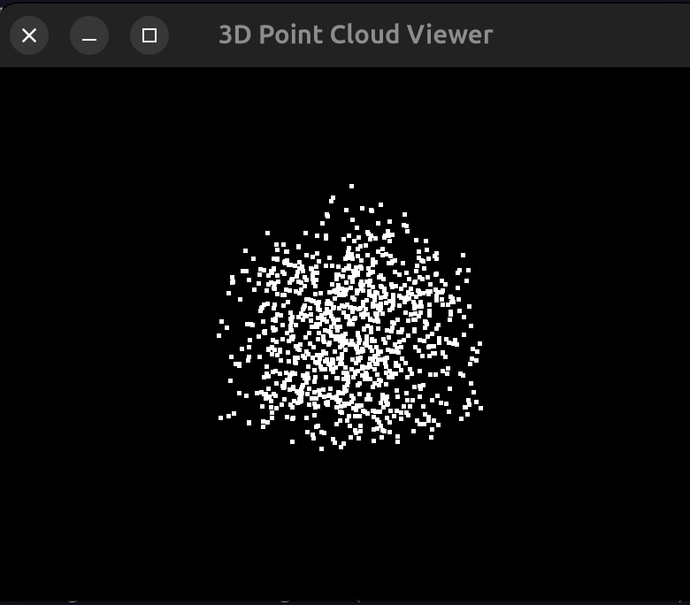

# 3D Point Cloud Viewer

A general-purpose 3D point cloud viewer built with OpenGL and GLFW, allowing you to visualize and interact with 3D point cloud data in real time. This viewer works with any 3D point data (x,y,z format)



## Features
- **3D Visualization**: Visualize any set of 3D points.
- **Interaction**: Rotate, zoom, and pan the 3D view with mouse and scroll.
- **Export**: Save the point cloud to `.ply` or `.csv` format.

## Requirements
- `glfw`
- `PyOpenGL`
- `numpy`

You can install the necessary dependencies via pip:

```bash
pip install glfw PyOpenGL numpy
```
